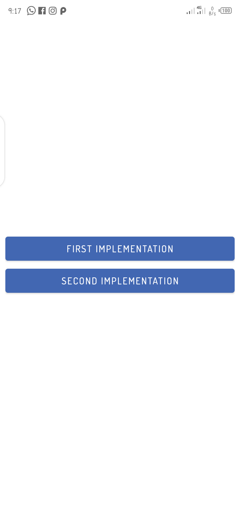
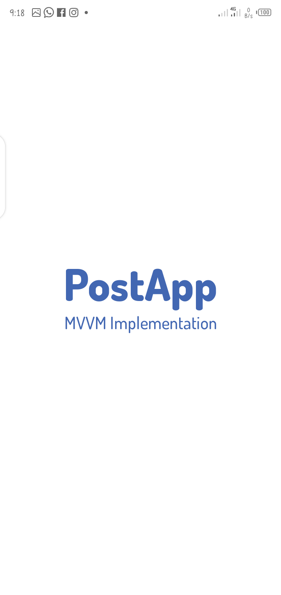
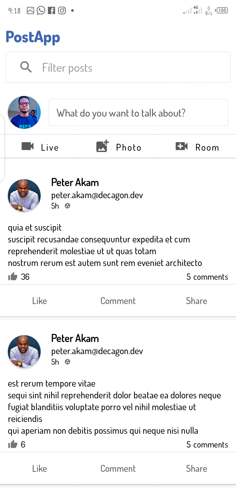
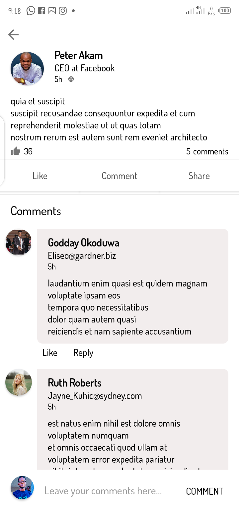

# Week-Nine-Json-Placeholder-API
* Using the endpoints found here https://jsonplaceholder.typicode.com
* build a simple application that shows a list of post
* and then a single post page with comments,
* you should be able to add new comment.
* Build a nice UI and the home page should have a search/filter field.
* You should also have a page to create a new post

{:height="50%" width="50%"}
{:height="50%" width="50%"}
{:height="50%" width="50%"}
{:height="50%" width="50%"}

